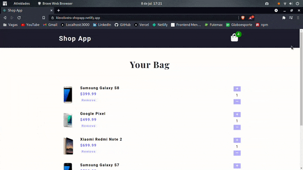

# Shop App / App de Compras
[](https://github.com/KlevertonOliveira/Shop-App-ReactJS/blob/master/LICENSE)

---

## :art: Layout web


---

[Project Presentation](https://klevoliveira-shopapp.netlify.app/) /
[Apresentação do Projeto](https://klevoliveira-shopapp.netlify.app/)

---

## :mag_right: About the project / Sobre o projeto

Shop App is a Front End application created with the objective of practicing the development of web applications using the ReactJS library. The application is inspired on the project called Cart by John Smilga in his course called Full React Course 2020.

The project consists of a list of items (to be purchased) that can be handled by the user with actions ranging from changing the quantity of a certain item to removing it, always taking into account that such changes have a direct impact on the total price of the purchase to be made.

---

Shop App / App de Compras é uma aplicação Front End criada com o objetivo de praticar o desenvolvimento de aplicações web utilizando a biblioteca ReactJS. A aplicação é inspirada no projeto denominado Cart de John Smilga em seu curso denominado Full React Course 2020.

O projeto consiste em uma lista de itens (a serem comprados) que podem ser manipulados pelo usuário no que tange a alteração da quantidade de determinado item ou a remoção do mesmo, sempre levando em consideração que tais alterações possuem impacto direto no preço total da compra a ser efetuada.

---

### Front end
- HTML5
- SASS (CSS3)
- JS ES6
- Javascript ES6
- ReactJS

## :file_folder: How to run the project / Como executar o projeto

Prerequisites / Pré-requisitos: npm / yarn

```bash
# Clone repository / Clonar repositório
git clone https://github.com/KlevertonOliveira/Shop-App-ReactJS.git

# Enter the project folder / Entrar na pasta do projeto
cd Shop-App-ReactJS

# Install dependencies / Instalar dependências
yarn install

# Run the project / Executar o projeto
yarn start
```

## :raising_hand_man: Author / Autor

José Kleverton Yvens Oliveira

https://www.linkedin.com/in/klevertonoliveira/
